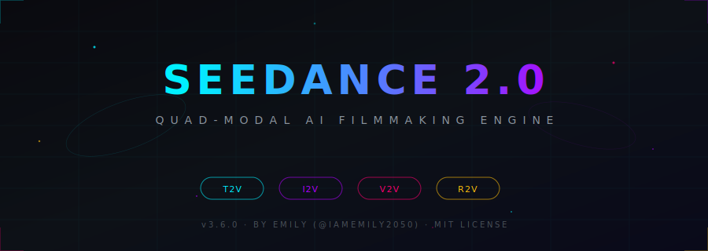

<picture>
  <source media="(prefers-color-scheme: dark)" srcset="assets/hero-dark.svg">
  <source media="(prefers-color-scheme: light)" srcset="assets/hero-light.svg">
  
</picture>

<p align="center">
  <a href="https://github.com/Emily2040/seedance-2.0/releases"></a>
  <a href="LICENSE"></a>
  <a href="skills"></a>
  <a href="#-multilingual-precision"></a>
  <a href="#-platform-matrix"></a>
  <a href="https://agentskills.io/"></a>
</p>

<p align="center">
  <code>Generate and direct cinematic AI videos with Seedance 2.0 (ByteDance / Dreamina / Jimeng).</code><br>
  <code>Text-to-Video · Image-to-Video · Video-to-Video · Reference-to-Video</code>
</p>

<p align="center">
  <b>Author:</b> <a href="https://github.com/Emily2040">Emily (@iamemily2050)</a> · 
  <b>Platform:</b> <a href="https://seed.bytedance.com">ByteDance Seedance 2.0</a> · Dreamina · Jimeng<br>
  <b>Updated:</b> 2026-02-25 · Q1 2026 release intelligence
</p>

---

## `>` Why Seedance 2.0?

<table>
<tr>
<td width="50%">

**For AI Filmmakers** — Stop writing flat prompts. Seedance 2.0 gives you a complete director's toolkit: camera language, motion control, lighting design, character fidelity, audio sync, and VFX integration — all structured as modular, composable skills that any AI agent can load on demand.

</td>
<td width="50%">

**For Agent Builders** — Each of the 19 sub-skills is independently loadable. Your agent reads the 75-line root `SKILL.md`, identifies the task, and loads only the specific modules it needs. Zero token waste. Maximum precision.

</td>
</tr>
</table>

> ⚠️ **Feb 2026 Status**: Seedance 2.0 API global release was delayed due to copyright enforcement actions. Real-person face uploads paused Feb 15. Content filters tightened for named franchise characters, anime IPs, and streaming originals. Run `seedance-copyright` before every generation.

<br>

## `>` Skill Constellation

> **Click any node** to navigate directly to that skill's documentation.

<p align="center">
  
</p>

<details>
<summary><b>📂 Full Skill Directory — Core Pipeline</b></summary>
<br>

| Skill | Emoji | What it does |
|:---|:---:|:---|
| [`seedance-interview`](skills/seedance-interview/SKILL.md) | 📋 | Guided pre-production interview → structured Seedance prompt |
| [`seedance-prompt`](skills/seedance-prompt/SKILL.md) | ✍️ | Build and validate prompts — 5-layer stack, @Tag system, quad-modal rules |
| [`seedance-camera`](skills/seedance-camera/SKILL.md) | 🎥 | Camera movement, shot framing, multi-shot sequences, anti-drift locks |
| [`seedance-motion`](skills/seedance-motion/SKILL.md) | 🏃 | Motion timing, action choreography, fight physics, video extension chains |
| [`seedance-lighting`](skills/seedance-lighting/SKILL.md) | 💡 | Lighting, atmosphere, light transitions, mood and time-of-day specs |
| [`seedance-characters`](skills/seedance-characters/SKILL.md) | 🎭 | Character identity locking, @Tag assignment, multi-character scene management |
| [`seedance-style`](skills/seedance-style/SKILL.md) | 🎨 | Visual style, render-engine tokens, period aesthetics, style-transfer reference |
| [`seedance-vfx`](skills/seedance-vfx/SKILL.md) | ✨ | VFX physics contracts, particle systems, destruction, energy effects |
| [`seedance-audio`](skills/seedance-audio/SKILL.md) | 🔊 | Native audio design, dialogue lip-sync, @Audio1 reference, desync fixes |
| [`seedance-pipeline`](skills/seedance-pipeline/SKILL.md) | 🔗 | ComfyUI nodes, API integration, Firebase Studio, post-processing chains |
| [`seedance-recipes`](skills/seedance-recipes/SKILL.md) | 📖 | Genre template recipes: product ads, fight scenes, music videos, and more |
| [`seedance-troubleshoot`](skills/seedance-troubleshoot/SKILL.md) | 🔧 | QA checklist, generation failure diagnostics, emergency fix procedures |

</details>

<details>
<summary><b>⚖️ Content Quality & Governance</b></summary>
<br>

| Skill | Emoji | What it does |
|:---|:---:|:---|
| [`seedance-copyright`](skills/seedance-copyright/SKILL.md) | ⚖️ | IP rules, safe substitutions, Feb 2026 enforcement data |
| [`seedance-antislop`](skills/seedance-antislop/SKILL.md) | 🚫 | Detects and removes AI filler language and hollow superlatives from prompts |

</details>

<details>
<summary><b>🌍 Multilingual Vocabulary</b></summary>
<br>

| Skill | Flag | Languages | Terms |
|:---|:---:|:---|---:|
| [`seedance-vocab-zh`](skills/seedance-vocab-zh/SKILL.md) | 🇨🇳 | Chinese cinematic vocabulary | 320+ |
| [`seedance-vocab-ja`](skills/seedance-vocab-ja/SKILL.md) | 🇯🇵 | Japanese cinematic vocabulary | 280+ |
| [`seedance-vocab-ko`](skills/seedance-vocab-ko/SKILL.md) | 🇰🇷 | Korean cinematic vocabulary | 270+ |
| [`seedance-vocab-es`](skills/seedance-vocab-es/SKILL.md) | 🇪🇸 | Spanish cinematic vocabulary (Castilian + Latin American) | 270+ |
| [`seedance-vocab-ru`](skills/seedance-vocab-ru/SKILL.md) | 🇷🇺 | Russian cinematic vocabulary (Eisenstein/Tarkovsky tradition) | 270+ |

</details>

<br>

## `>` Quick Install

```bash
# Antigravity
antigravity skills install https://github.com/Emily2040/seedance-2.0

# Gemini CLI
gemini skills install https://github.com/Emily2040/seedance-2.0

# Claude Code
claude skills install https://github.com/Emily2040/seedance-2.0

# GitHub Copilot / Codex
codex skills install https://github.com/Emily2040/seedance-2.0

# Cursor
cursor skills install https://github.com/Emily2040/seedance-2.0

# Windsurf
windsurf skills install https://github.com/Emily2040/seedance-2.0

# OpenCode
opencode skills install https://github.com/Emily2040/seedance-2.0
```

<details>
<summary><b>📁 Manual Installation Paths</b></summary>
<br>

| Platform | Workspace path | Global path |
|:---|:---|:---|
| **Antigravity** | `.agent/skills/seedance-20/` | `~/.gemini/antigravity/skills/seedance-20/` |
| **Gemini CLI** | `.gemini/skills/seedance-20/` | `~/.gemini/skills/seedance-20/` |
| **Firebase Studio** | `.idx/skills/seedance-20/` | — |
| **Claude Code** | `.claude/skills/seedance-20/` | `~/.claude/skills/seedance-20/` |
| **OpenClaw** | `.claude/skills/seedance-20/` | `~/.claude/skills/seedance-20/` |
| **GitHub Copilot** | `.github/skills/seedance-20/` | `~/.copilot/skills/seedance-20/` |
| **Codex** | `.agents/skills/seedance-20/` | `~/.agents/skills/seedance-20/` |
| **Cursor** | `.cursor/skills/seedance-20/` | `~/.cursor/skills/seedance-20/` |
| **Windsurf** | `.windsurf/skills/seedance-20/` | `~/.codeium/windsurf/skills/seedance-20/` |
| **OpenCode** | `.opencode/skills/seedance-20/` | `~/.config/opencode/skills/seedance-20/` |

</details>

<br>

## `>` Platform Matrix

<table>
<tr>
<td align="center" width="11%"><b>Antigravity</b></td>
<td align="center" width="11%"><b>Gemini CLI</b></td>
<td align="center" width="11%"><b>Firebase</b></td>
<td align="center" width="11%"><b>Claude Code</b></td>
<td align="center" width="11%"><b>OpenClaw</b></td>
<td align="center" width="11%"><b>Copilot</b></td>
<td align="center" width="11%"><b>Codex</b></td>
<td align="center" width="11%"><b>Cursor</b></td>
<td align="center" width="11%"><b>Windsurf</b></td>
</tr>
<tr>
<td align="center">✅</td>
<td align="center">✅</td>
<td align="center">✅</td>
<td align="center">✅</td>
<td align="center">✅</td>
<td align="center">✅</td>
<td align="center">✅</td>
<td align="center">✅</td>
<td align="center">✅</td>
</tr>
</table>

<br>

## `>` Multilingual Precision

Seedance 2.0 includes dedicated cinematic vocabulary modules for five languages, enabling native-language prompt engineering for maximum generation fidelity.

<table>
<tr>
<td align="center"><b>🇨🇳 Chinese</b><br><code>vocab-zh</code><br><sub>296 lines</sub></td>
<td align="center"><b>🇯🇵 Japanese</b><br><code>vocab-ja</code><br><sub>235 lines</sub></td>
<td align="center"><b>🇰🇷 Korean</b><br><code>vocab-ko</code><br><sub>225 lines</sub></td>
<td align="center"><b>🇪🇸 Spanish</b><br><code>vocab-es</code><br><sub>232 lines</sub></td>
<td align="center"><b>🇷🇺 Russian</b><br><code>vocab-ru</code><br><sub>235 lines</sub></td>
</tr>
</table>

<br>

## `>` Architecture

```
seedance-2.0/
├── SKILL.md                         ← Root entry point (75 lines)
├── LICENSE                          ← MIT
├── README.md                        ← You are here
├── CHANGELOG.md                     ← v3.0.0 → v3.6.0
├── .github/
│   └── CODEOWNERS                   ← @iamemily2050
├── skills/                          ← 19 modular sub-skills
│   ├── seedance-interview/          ← 📋 Pre-production
│   ├── seedance-prompt/             ← ✍️ Prompt architecture
│   ├── seedance-camera/             ← 🎥 Camera language
│   ├── seedance-motion/             ← 🏃 Motion control
│   ├── seedance-lighting/           ← 💡 Lighting design
│   ├── seedance-characters/         ← 🎭 Character fidelity
│   ├── seedance-style/              ← 🎨 Style control
│   ├── seedance-vfx/                ← ✨ VFX integration
│   ├── seedance-audio/              ← 🔊 Audio & lip-sync
│   ├── seedance-pipeline/           ← 🔗 Pipeline ops
│   ├── seedance-recipes/            ← 📖 Genre recipes
│   ├── seedance-troubleshoot/       ← 🔧 QA & debugging
│   ├── seedance-copyright/          ← ⚖️ IP governance
│   ├── seedance-antislop/           ← 🚫 Language filter
│   ├── seedance-vocab-zh/           ← 🇨🇳 Chinese
│   ├── seedance-vocab-ja/           ← 🇯🇵 Japanese
│   ├── seedance-vocab-ko/           ← 🇰🇷 Korean
│   ├── seedance-vocab-es/           ← 🇪🇸 Spanish
│   └── seedance-vocab-ru/           ← 🇷🇺 Russian
└── references/                      ← 4 reference files
    ├── platform-constraints.md      ← Platform limits & rules
    ├── json-schema.md               ← JSON prompt schema
    ├── prompt-examples.md           ← Copy-paste examples
    └── quick-ref.md                 ← Quick reference card
```

<br>

## `>` References

| File | Purpose |
|:---|:---|
| [`platform-constraints.md`](references/platform-constraints.md) | Platform limits, resolution caps, and known behaviors |
| [`json-schema.md`](references/json-schema.md) | JSON prompt schema for structured generation |
| [`prompt-examples.md`](references/prompt-examples.md) | Compact, copy-paste prompt examples |
| [`quick-ref.md`](references/quick-ref.md) | Quick reference card for all parameters |

<br>

## `>` Compliance

All 20 skills pass the [AgentSkills open standard](https://agentskills.io/) validation:

- ✅ `name` — lowercase, hyphen-separated, no dots or spaces
- ✅ `description` — single-quoted, verb-first, includes WHEN trigger phrases
- ✅ `license: MIT` · `user-invocable: true` · `user-invokable: true`
- ✅ `tags:` array and `metadata` with `version`, `updated`, `author`, platform blocks
- ✅ `metadata.parent: seedance-20` on all 19 sub-skills
- ✅ No illegal top-level custom fields

<br>

## `>` Changelog

See [`CHANGELOG.md`](CHANGELOG.md) for the full version history from v3.0.0 to v3.6.0.

<br>

## `>` Contributing

Contributions are welcome. Fork the repository, create a feature branch, and submit a pull request. All contributions will be reviewed by [@Emily2040](https://github.com/Emily2040).

<br>

## `>` License

```
MIT © 2026 Emily (@iamemily2050)
```

---

<p align="center">
  <sub>Built with precision by <b>Emily (@iamemily2050)</b> — AI artist, filmmaker, and agent skill architect.</sub><br>
  <sub>
    <a href="https://x.com/iamemily2050">𝕏 @iamemily2050</a> · 
    <a href="https://instagram.com/iamemily2050">IG @iamemily2050</a> · 
    <a href="https://github.com/Emily2040">GitHub @Emily2040</a>
  </sub><br>
  <sub>Source intelligence: ByteDance Seedance 2.0 official blog, Douyin creator community, CSDN practitioner tutorials, Q1 2026.</sub>
</p>
